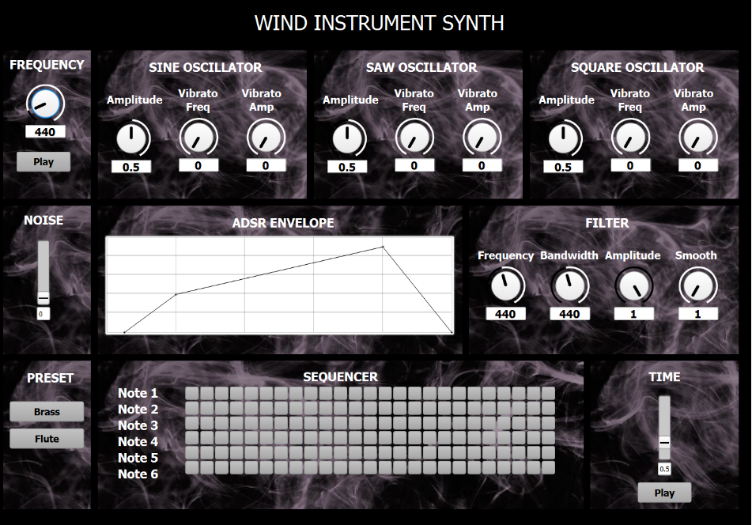
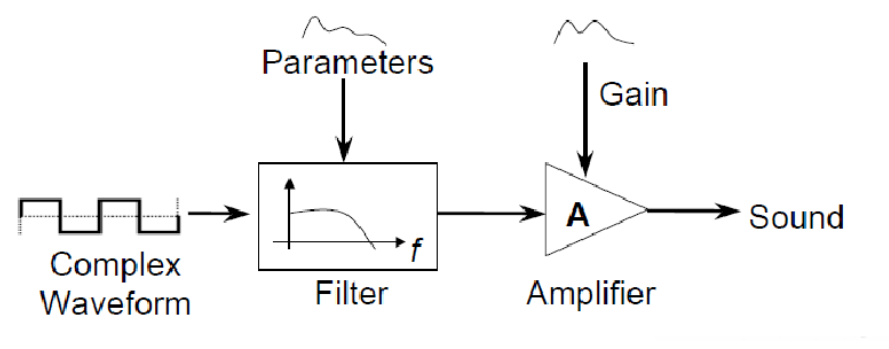
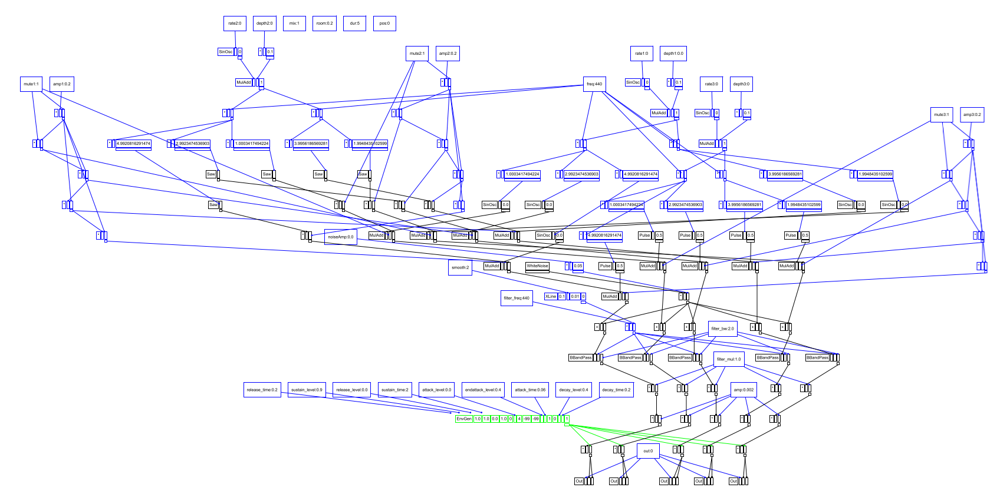

# group1-hw-SC-Xenharmonics
Group 1 repository for the SC homework of CMLS 2022

## Goal

To implement in the Supercollider programming language an emulation of a wind instrument based on subtractive synthesis, and a GUI to let the user experiment with synthesis parameters and play the instrument itself.

## Implementation - GUI and sequencer

Our project’s GUI appears as above. We give a detailed explanation of each of the blocks.

+ In the top left corner we put a preview box, where the user can select the frequency through a knob and hear the corresponding tone produced by the synth, toggling the play/stop button underneath.
+ The remaining three blocks in the top row are used to set the parameters of the three oscillators involved in the sound synthesis. We chose a sine oscillator, a sawtooth and a square wave. For each of them, the user can select the amplitude and the amount of vibrato desired.
+ Moving down a row, next we have a slider controlling the amount of noise to add to the oscillators, to emulate the turbulent air flow which naturally happens when blowing through a wind instrument, and a graph representing the ADSR envelope applied to the waveshape. The points in the graph are movable to set the envelope times and levels.
<ins> Note to the user </ins>: excessive duration of the envelope  with respect to the sequencer timing may result in overcrowding the server. Caution is advised.

```ruby
b = EnvelopeView(envBox, Rect(0, 0, 520, 150))
    .drawLines_(true)
    .selectionColor_(Color.red)
    .drawRects_(true)
    .resize_(5)
    .step_(0.05)
    .action_({arg x;
	switch (x.index,
		0,   { attack_time=x.value[0][0]; attack_level=x.value[1][0] },
		1,   { decay_time=x.value[0][1]; decay_level=x.value[1][1] },
		2,   { sustain_time=x.value[0][2]; sustain_level=x.value[1][2] },
		3,   { release_time=x.value[0][3]; release_level=x.value[1][3] }
);})
    .thumbSize_(5)
    .value_([[attack_time, decay_time, sustain_time, release_time],[ attack_level, decay_level, sustain_level, release_level]]);
```

+ Last component concerning the sound synthesis is the filter block: we opted for a bandpass filter, whose cutoff frequency, bandwidth, amplitude and cutoff curve smoothing are controlled by knobs.
+ Trying out different combinations of parameters, we found two combinations which we inserted as presets, one resembling a brass instrument and another one sounding like a flute.
+ The last block at the bottom controls the sequencing algorithm. We implemented a six stages sequencer. For each stage a row of buttons lets the user select the corresponding note through MIDI numbers:
```ruby
b_1_1 = Button.new(seqBox, bounds:Rect(0,0,20,20)).states_([
    [" ", Color.black, Color.grey(0.7)],
	["", Color.green(0.7), Color.green(0.7)]
]).font_(Font("Monaco", 14, true))
.action_({|b|
	if (b.value == 1)
	{note1=1; b_1_2.value=0; b_1_3.value=0; b_1_4.value=0; b_1_5.value=0; 
  b_1_6.value=0; b_1_7.value=0; b_1_8.value=0; b_1_9.value=0; b_1_10.value=0; 
  b_1_11.value=0; b_1_12.value=0; b_1_13.value=0; b_1_14.value=0; b_1_15.value=0; 
  b_1_16.value=0; b_1_17.value=0; b_1_18.value=0; b_1_19.value=0; b_1_20.value=0; 
  b_1_21.value=0; b_1_22.value=0; b_1_23.value=0; b_1_24.value=0; b_1_25.value=0;}});
```
+ The Play button then starts a sequence which cycles over the MIDI note numbers corresponding to the active buttons, waiting an amount of time specified by the Time slider between two consecutive notes.
```ruby
playSeq = Button.new(seq_time, bounds:Rect(0,0,80,30)).states_([
  ["Play", Color.black, Color.grey(0.7)],
	["Stop", Color.red(0.7), Color.grey(0.7)]
]).action_({|b|
	if(b.value == 1)
	{p = Pseq([note1, note2, note3, note4, note5, note6], inf).asStream ; {
inf.do{
	Synth(\wind_instrument , [\freq , (p.next+70).midicps, \attack_time, 0.05, 
	\decay_time, 0.05, \sustain_time, 0.1, \release_time, 0.05]) ; (tempo).wait ;
} }.fork;}
	{p.stop;}}).font_(Font("Monaco", 14, true));
```

## Implementation - Sound Synthesis


As said, the main sound source is composed of the sum of three kinds of oscillator: a sine, a sawtooth and a square wave. For each of them, the first five harmonics with respect to the chosen frequency are summed. The amplitude of the harmonics is geometrically tapered.
To this is then added a layer of white noise, to emulate the “air blow” effect, and this constitutes the complex waveform which is then filtered to produce the desired sound.
```ruby
var num = 5;
var harms = Array.series(num, 1, 1) * Array.exprand(num, 0.995, 1.001);
osc1=SinOsc.ar([freq,freq] * SinOsc.kr(rate1,0,depth1*0.1,1) * harms, mul:Array.geom(num, 1*mute1, amp1*mute1));
osc2=Saw.ar([freq,freq] * SinOsc.kr(rate2,0,depth2*0.1,1) * harms, mul:Array.geom(num, 1*mute2, amp2*mute2));
osc3=Pulse.ar([freq,freq] * SinOsc.kr(rate3,0,depth3*0.1,1) * harms, mul:Array.geom(num, 1*mute3, amp3*mute3));
noise = WhiteNoise.ar(noiseAmp*0.05);
```

The next step is to filter the obtained waveform: to this end we applied a bandpass filter, whose cutoff frequency and bandwidth parameters can be set by the user.
```ruby
sig = BBandPass.ar(osc1+osc2+osc3+noise, filter_freq * XLine.kr(0.1,smooth,0.01), filter_bw, filter_mul);
```

We also applied an ADSR envelope, 

```ruby
env = EnvGen.ar(Env.new(
		[ attack_level, endattack_level, decay_level, sustain_level, release_level], 
    [attack_time, decay_time, sustain_time, release_time], 'linear' ), doneAction:2);
```
and we wrapped it all into a SynthDef called \wind_instrument, which is then used to generate the synths needed to output sound.

## UGEN Graph

