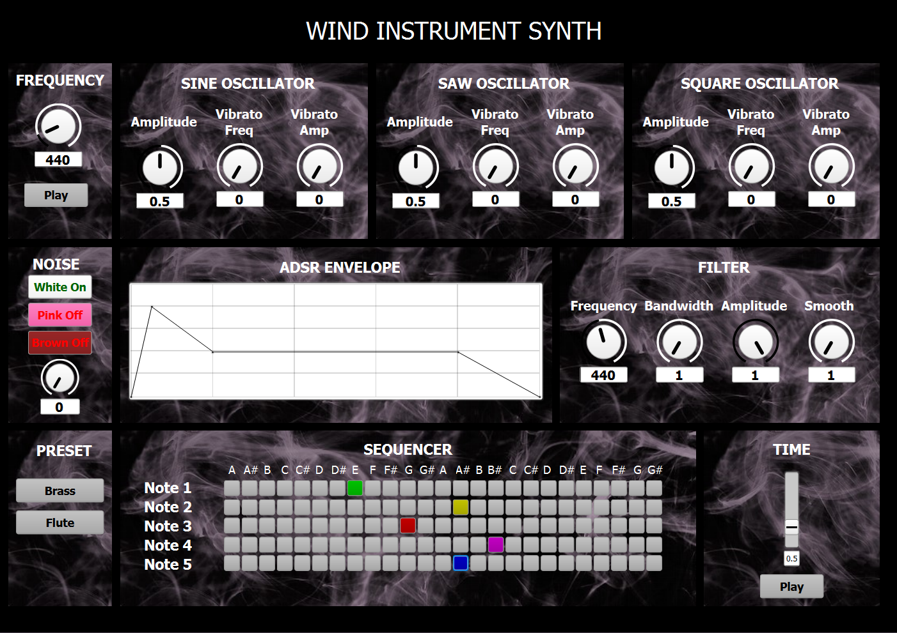

# CMLS HW1 - Assignment 2: Synthesis of a wind instrument through Subtractive synthesis

The goal of this assignment was to implement an emulation of a wind instrument based on subtractive synthesis, using the SuperCollider programming language, along with a GUI to let the user experiment with the synthesis parameters provided and to play the instrument itself.

## Subtractive Synthesis

**Subtractive synthesis** is a method of sound synthesis in which a complex waveform (usually a sawtooth, square or triangle wave) is filtered and modified to produce a simpler sound. So, this technique mainly involves starting with a rich sound, such as the previously mentioned waves with a lot of harmonics, and removing some of those frequencies to create a new sound.

The process involves using filters to remove specific frequencies from the sound, along with other tools such as envelopes and LFOs (low-frequency oscillators) to shape the sound over time.
  

  

 
The filtered signal can be further manipulated by changing its general gain and envelope, as seen in the diagram above, controlling its evolution over time (specifically its ADSR).

## Wind Instrument Synth - About

### GUI

  

Our project’s GUI appears as above. The main blocks that can be seen are:

+ **Play**: located in the top left corner it allows to select the frequency through a knob and to play the corresponding note on the synth, using the dedicated button
+ **Oscillators**: three boxes contain the oscillators, each generating a distinct wave (sine, saw, square), their parameters are:
  - *Amplitude*: controls the intensity of the wave
  - *Vibrato frequency*: frequency of the amplitude LFO which creates a vibrato effect
  - *Vibrato amplitude*: depth of the vibrato effect
+ **Noise**: adds a noise wave to the signal, simulating the breath of the performer. It provides:
  - *Amplitude slider*: intensity of the noise
  - *Noise selection*: allows to choose the type of noise between **white**, **brown** and **pink**
+ **ADSR**: this block provides a graphical interface to edit the sound's envolope, in particular its **attack**, **decay**, **sustain** and **release**
+ **Filter**: bandpass filter, you can control its:
  - *Cutoff frequency*: low frequency cutoff
  - *Bandwidth*: bandwith of the bandpass, sets the high frequency cutoff
  - *Amplitude*: sets gain of signal
  - *Cutoff curve smoothing*: changes slope of cutoff curve
+ **Presets**: the user can choose between two different presets, which simulate a brass instrument and a flute
+ **Sequencer**: five stage sequencer, each row lets the user choose which MIDI note to play (flow from top to bottom). Playback speed can be controlled.
<ins> **Note to the user** </ins>: using a long release envelope with a fast sequencer playback may result in overcrowding of the server. Caution is advised.

### Sound Generation

The main sound source is composed of the sum of the three **oscillator** signals: a sine, a sawtooth and a square wave. For each of them, the first five harmonics with respect to the chosen frequency are summed. The amplitude of the harmonics is geometrically tapered.
A layer of **noise** is then added, to emulate the breathing of the performer, this last step creates the final complex waveform, which is then filtered to produce the desired sound.
A **bandpass filter** is then applied, whose cutoff frequency and bandwidth parameters, as it was mentioned before, can be set by the user.
The last step in the subtractive synthesis of the sound is to apply the **ADSR envelope**, in order to control the gain of the sound over time.

The whole instrument is wrapped it into a single SynthDef called *\wind_instrument*, which needs to be defined in order to generate the synths needed to output sound.

  

